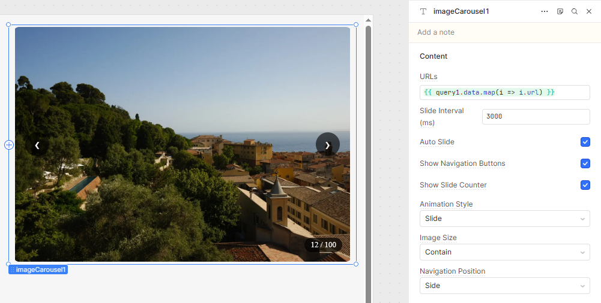

Username  
widlestudiollp

Project Name  
Image Carousel

About  
Image Carousel is a modern and highly customizable Retool custom component designed to display images in an interactive and visually rich carousel format.

It includes multiple animation styles, auto-play functionality, flexible navigation controls, responsive layouts, and dynamic configuration options — all without relying on external libraries.

The component is built to provide a smooth and professional image viewing experience inside Retool apps, similar to modern web sliders.

Preview  

Features  
🖼 Display multiple images in a smooth carousel  
▶️ Auto-play with configurable interval  
🎛 Multiple animation styles (slide, fade, zoom, rotate, blur, etc.)  
⏯ Manual navigation (Previous / Next buttons)  
📍 Navigation position control (side or bottom)  
👁 Show / Hide navigation buttons  
🔢 Show / Hide slide counter  
⚙ Image fit modes (cover / contain)  
🎯 Dot indicators for quick navigation  
📱 Fully responsive layout  
⚡ Smooth transitions and performance optimized

How it works  
The component receives image URLs from Retool using the imageUrls input.

Each item should be a valid image URL string.

The component internally manages:

Current slide index  
Auto-play interval handling  
Animation transitions  
Navigation direction  
UI state (buttons, counter, dots)

Example input  
[
"https://picsum.photos/id/237/200/300",
"https://picsum.photos/seed/picsum/200/300",
"https://picsum.photos/200/300?grayscale"
]
