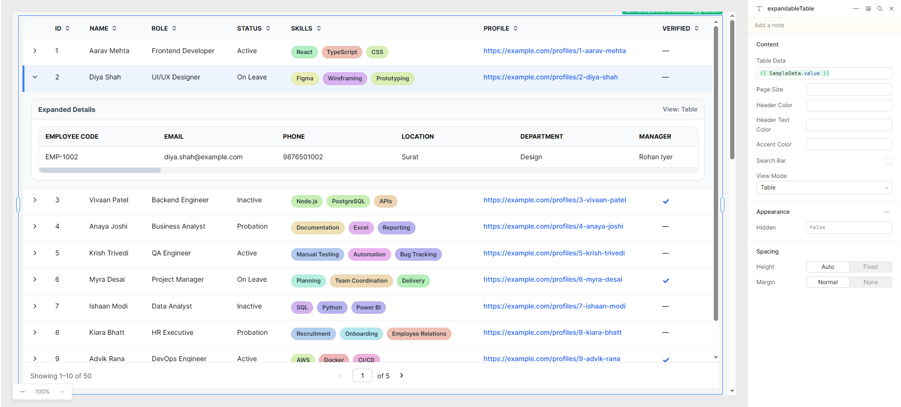

## Username

widlestudiollp

## Project Name

Multi-View Expandable Table

## About

Multi-View Expandable Table is a flexible Retool custom component that helps you display complex datasets in a clean and interactive table.

It supports sorting, pagination, row expansion, search, and multiple expandable detail views. This makes it useful when you want to show both summary-level data and detailed row information in the same component.

Each row can be expanded to display nested `details` data in different formats such as table view, cards, bar chart, and key-value pair view.

---

## Preview



---

## How it works

The component receives data from Retool using the `tableData` state and renders it into a dynamic table.

If no external data is provided, the component automatically falls back to built-in sample data so users can preview the component behavior quickly.

Each row can be expanded to show its nested `details` object using the selected expandable view mode.

### Expand view modes

- **Table** → Shows details in a horizontal table layout
- **Cards** → Displays detail values in individual cards
- **Bar Chart** → Builds a chart automatically from numeric detail fields
- **Key Value Pair** → Shows details in a simple two-column layout

### Behavior logic

- Arrays are displayed as tags
- URLs are rendered as clickable links
- Boolean values are shown using icons
- Nested data is handled automatically
- Sample data is shown when external data is not passed
- Search bar visibility is controlled using a checkbox input

---

## Example input

```json
[
  {
    "id": 1,
    "name": "Aarav Mehta",
    "role": "Frontend Developer",
    "status": "Active",
    "skills": ["React", "TypeScript"],
    "profile": "https://example.com",
    "verified": true,
    "details": {
      "email": "aarav@example.com",
      "location": "Ahmedabad",
      "experienceYears": 3
    }
  }
]
```

---

## Build process

Built using React and integrated with Retool using `@tryretool/custom-component-support`.

The component uses Retool state inputs for table data, page size, colors, search bar visibility, and default view mode.

---

## Installation

1. Create a Retool Custom Component
2. Paste the component code
3. Bind your data to `tableData`
4. Configure inputs like `pageSize`, `showSearchBar`, `viewMode`, and colors
5. Add an optional `cover.png` image in your repo for preview

---

## Key implementation details

- Uses `useMemo` for efficient data processing
- Supports client-side sorting
- Supports global search across nested data
- Includes pagination with page controls
- Uses sticky headers for better usability
- Supports responsive layouts
- Generates charts dynamically from numeric values
- Uses a boolean checkbox input for search bar visibility
- Includes labels for Retool inputs for easier configuration

---

## Retool Inputs

| Name            | Type          | Description                        |
| --------------- | ------------- | ---------------------------------- |
| tableData       | Array         | Main dataset for the table         |
| pageSize        | String/Number | Number of rows per page            |
| headerColor     | String        | Table header background color      |
| headerTextColor | String        | Table header text color            |
| accentColor     | String        | Accent color used in the component |
| showSearchBar   | Boolean       | Show or hide the search bar        |
| viewMode        | Enum          | Default expandable detail view     |

---

## Use Cases

- Admin dashboards
- Employee management systems
- Analytics dashboards
- CRM tools
- Internal data review tools

---

## Notes for Retool users

- Pass your main dataset into `tableData`
- Put nested row details inside a `details` object
- Use the `showSearchBar` checkbox to control search visibility
- Use `viewMode` to decide the default expanded detail layout
- If your data is empty, the component will show sample data automatically
