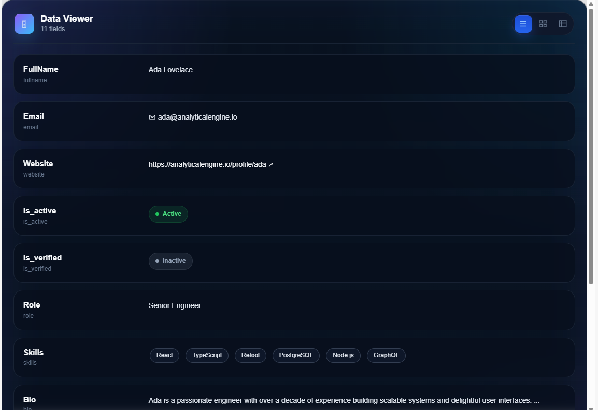

## Username

widlestudiollp

## Project Name

Smart Data Viewer

## About

Smart Data Viewer is an intelligent data inspection component for Retool that transforms raw object and JSON data into a clean, structured, and interactive viewing experience. It automatically analyzes incoming data and renders each field using context-aware UI patterns such as badges, tags, nested object explorers, links, and expandable content blocks.

The component supports multiple viewing layouts including list, card, and table modes, allowing users to inspect structured data in the format best suited to their workflow. Smart Data Viewer helps developers and internal teams quickly explore records, API responses, payloads, and deeply nested objects without manually formatting raw data.

## Preview



## How it works

The component receives data through Retool state (`data`) and dynamically inspects each field to determine how it should be rendered.

It evaluates the type and structure of each value, then automatically applies the most appropriate visual representation for improved readability and usability.

### Rendering logic

* Boolean values → Active / Inactive status chips
* Arrays → Tag pills
* Objects → Expandable nested object viewer
* URLs → Clickable external links
* Emails → Inline email formatting
* Long text → Truncated preview with Show more / Show less
* Null values → Muted null badge
* Standard text / numbers → Plain formatted text

The component recursively renders nested objects, allowing users to expand and inspect deeply structured data without losing context.

Users can switch between multiple view modes depending on how they want to inspect the data.

### View modes

* List view → Key-value row layout for detailed scanning
* Card view → Compact card-based layout for dashboard browsing
* Table view → Structured table layout for dense data inspection

### Example input

```json
{
  "id": 8421,
  "fullName": "Ada Lovelace",
  "email": "ada@analyticalengine.io",
  "website": "https://analyticalengine.io/profile/ada",
  "is_active": true,
  "is_verified": false,
  "role": "Senior Engineer",
  "skills": ["React", "TypeScript", "Retool", "PostgreSQL"],
  "bio": "Ada is a passionate engineer with over a decade of experience building scalable systems and delightful user interfaces.",
  "metadata": {
    "createdAt": "2024-01-12T10:24:00Z",
    "lastLogin": "2026-04-21T08:11:53Z",
    "preferences": {
      "theme": "dark",
      "notifications": true
    }
  }
}
```

## Build process

The component is built using React and integrates with Retool through `@tryretool/custom-component-support`. It uses custom rendering logic and adaptive UI patterns to intelligently display structured data in a polished and readable format.

### Key implementation details

* Uses React state for layout switching and expandable content
* Integrates directly with Retool state using `Retool.useStateObject`
* Implements intelligent type detection for adaptive rendering
* Recursively renders nested objects for deep inspection
* Supports expandable long-text previews and collapsible object trees
* Automatically adapts layout across list, card, and table views
* Uses custom CSS for a modern dark UI with responsive behavior

### Extensibility

The component is designed to be easily extendable. Developers can:

* Add additional render types (e.g. dates, images, code blocks)
* Add custom field formatters
* Extend nested object rendering behavior
* Add field grouping and sorting
* Add search and filtering controls
* Customize themes and layout styles
* Integrate advanced schema-aware rendering
