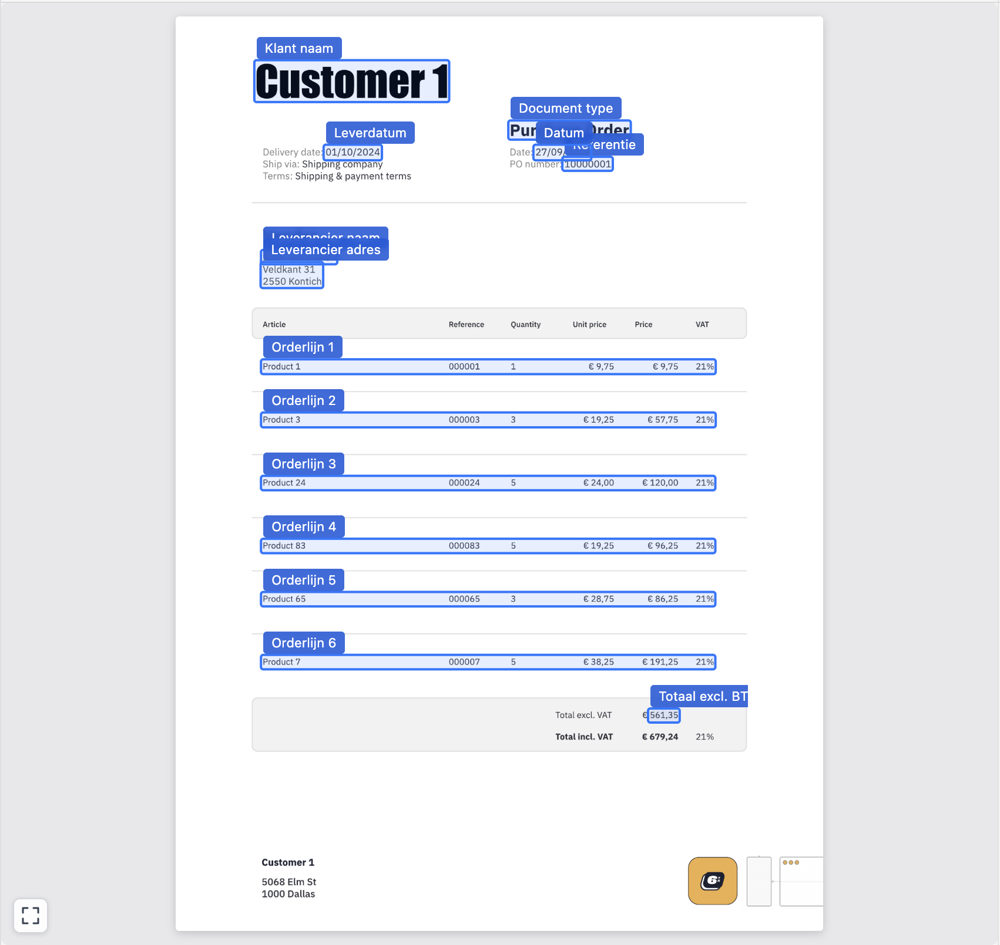
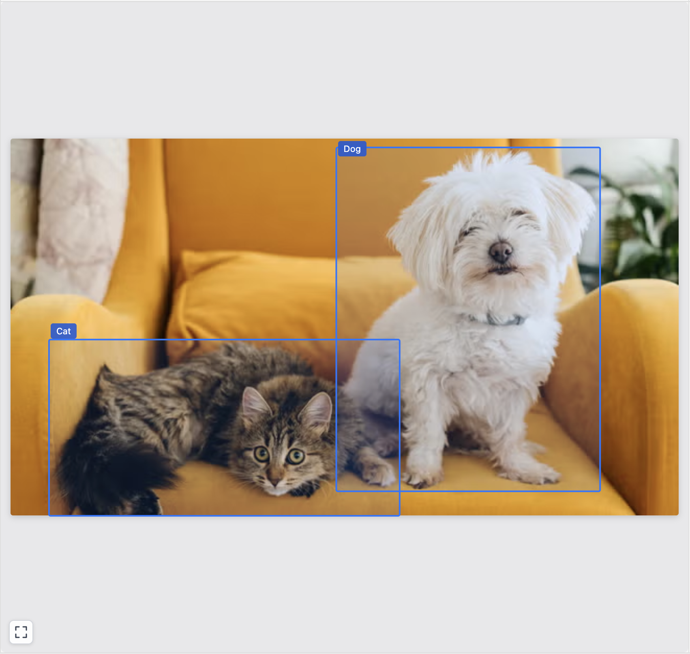

# Bounding Box V2

A custom [Retool](https://retool.com/) component that renders multi-page document images with interactive bounding box overlays, built for document processing and review workflows.

 

## Features

- **Multi-page navigation** — Previous/next controls appear automatically when more than one page is provided.
- **Zoom & pan** — Scroll to zoom toward the cursor; drag to pan while zoomed in. A reset button recenters the view.
- **Bounding box overlays** — Field regions are drawn as SVG overlays on top of the page image. Hovering a box highlights it and emits an event.
- **Bidirectional hover sync** — Hovering a box from inside the component or setting `hoveredField` from outside (e.g. a table row hover) both work; the component automatically navigates to the correct page.

## Retool State Properties

| Property | Type | Default | Description                                                                                                                                  |
|---|---|---|----------------------------------------------------------------------------------------------------------------------------------------------|
| `imageUrls` | `string[]` | `[]` | Array of Retool Storage image URLs, one per document page                                                                                    |
| `boundingBoxes` | `object[]` | `[]` | Array of bounding box objects (see schema below)                                                                                             |
| `hoveredField` | `string` | `""` | `fieldKey` of the currently highlighted field, set this from an external Retool state variable to highlight a box from outside the component |

### Bounding box schema

Each entry in `boundingBoxes` must have the following shape:

```json
{
  "fieldKey": "invoice_number",
  "label": "Invoice Number",
  "page": 0,
  "x": 0.62,
  "y": 0.08,
  "width": 0.21,
  "height": 0.03
}
```

| Field | Type | Description |
|---|---|---|
| `fieldKey` | `string` | Unique identifier for the field; used for hover matching |
| `label` | `string` (optional) | Tooltip text shown above the box on hover |
| `page` | `number` | Zero-based page index the box belongs to |
| `x` | `number` | Left edge, normalised 0–1 relative to the page image width |
| `y` | `number` | Top edge, normalised 0–1 relative to the page image height |
| `width` | `number` | Box width, normalised 0–1 |
| `height` | `number` | Box height, normalised 0–1 |

## Retool Events

| Event | Payload | Description |
|---|---|---|
| `onHoverChange` | `{ fieldKey: string }` | Fired when the hovered field changes. `fieldKey` is `""` when the cursor leaves a box. Wire this to a shared state variable to keep an external table in sync. |

## Zoom & Pan Controls

| Interaction | Effect |
|---|---|
| Scroll wheel | Zoom in/out toward the cursor position |
| Click + drag | Pan the image |
| Reset button (bottom-left corner) | Recenter and reset zoom to 1× |
