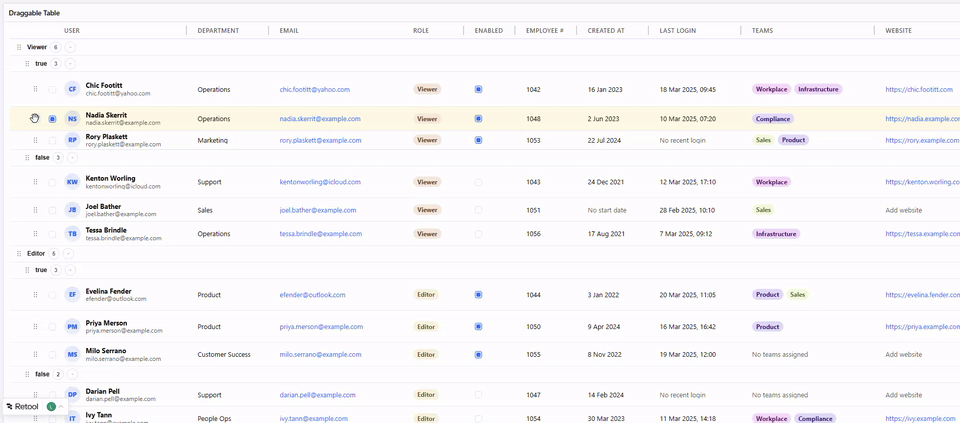
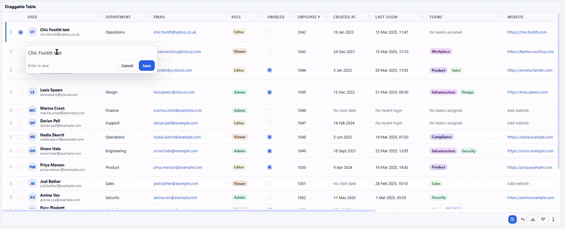
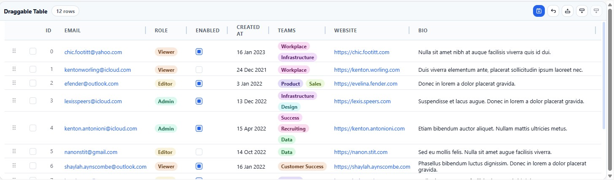

# Draggable Table

> A drag-and-drop Retool table for reorder-heavy workflows, grouped data, and inline editing.

## Author

- **Name:** Liam Wallace
- **Community Username:** @liamgwallace
- **Email:** liamgwallace@gmail.com

## About

Draggable Table is a custom Retool component for apps where users need to reorder rows, edit values in place, and work with grouped datasets. It supports row drag-and-drop, optional group reordering, cross-group moves, selection, add-row actions, and dirty-state outputs so Retool apps can save exactly what changed.

It is useful when the built-in table does not give enough control over ordering workflows, grouped drag-and-drop interactions, or richer inline editing patterns.

It tries to keep much of the functionality of the standard retool table.

## Tags

`UI Components`, `Data Tables`, `Drag and Drop`

## Demos

### Drag-and-drop



### Cell types



## Preview



## What it does

- Reorders rows with drag handles.
- Supports grouped tables with optional group-level reordering.
- Supports dragging rows across groups and writing the new group value back into the row.
- Supports inline editing for most common table value types.
- Tracks dirty state, edits, reorder changes, selected rows, and newly inserted rows.
- Exposes Retool events for row clicks, saves, cancels, cell edits, selection changes, and reorder actions.
- Accepts Retool theme tokens plus simple shell-level style overrides.

## Main features

- Row drag and drop.
- Multi-select row movement when `multiSelectEnabled` is on.
- Add row at top, bottom, or after the currently selected row.
- Delete one or more selected rows from the toolbar.
- Inline editors for text, email, dates, booleans, tags, multiple tags, progress sliders, markdown, and HTML.
- Configurable columns using JSON.
- Configurable visible column order using JSON.
- Optional single-level or multi-level grouping using JSON.
- Sticky headers, title/header toggles, row density controls, loading state, and toolbar controls.

## Build and deploy

Build the component bundle:

```bash
npm run build
```

Retool custom component workflow:

1. `npm run retool:login`
2. `npm run retool:init`
3. `npm run retool:dev`
4. `npm run retool:deploy`

The export used by Retool is `RetoolDraggableTable` from `src/index.tsx`.

## Retool setup

At a minimum, configure these inputs:

1. `dataSource`
2. `primaryKey`
3. `columnsJson`
4. `columnOrderingJson`
5. `groupByColumnsJson` if you want grouped rows

6. Common optional Inputs:

- `tagOptionsSources` when multiple tag columns should reuse the same option lists.
- `showDisplayIndexColumn` when you want the leading `#` column that shows current display order.

The shipped defaults already provide working sample data and sample columns, so the component renders immediately after adding it to an app.

`primaryKey` and `indexColumn` are freeform text inputs in Retool now, not sample-value dropdowns. Enter the exact field names from your own row objects.

Height mode note:

- Fixed height is the stable supported mode for this component in Retool.
- Auto height is still inconsistent in Retool custom-component sizing. In some cases it initially renders too short, then snaps to the correct height after another layout change such as adjusting width.
- If you need predictable behavior, use fixed height.

## Input reference

### `dataSource`

`dataSource` is an array of row objects. Each object becomes one row in the table.

Typical binding:

```js
{{ query1.data }}
```

Default sample row shape:

```json
{
  "id": 0,
  "user": "Chic Footitt",
  "department": "Operations",
  "email": "chic.footitt@yahoo.com",
  "role": "Viewer",
  "enabled": true,
  "employeeNumber": 1042,
  "createdAt": "2023-01-16",
  "lastLoginAt": "2025-03-18T09:45:00",
  "teams": ["Workplace", "Infrastructure"],
  "website": "https://chic.footitt.com",
  "bioHtml": "<strong>Nulla sit amet nibh</strong> at augue facilisis viverra quis id dui.",
  "notesMarkdown": "## Quick note\n- Prefers async updates\n- Uses the customer inbox",
  "progress": 12,
  "internalNotes": "Hidden sample row note\nNeeds review before export."
}
```

The shipped sample `dataSource` now includes 15 rows so you can test scrolling, selection, nested grouping, nullable fields, and edit behavior with a less trivial dataset.

Guidance:

- Every row should have a stable unique value in the field used by `primaryKey`.
- If `primaryKey` is missing or blank for a row, the component falls back to `indexColumn`, then finally to the row index.
- If you want reorder changes to be persisted to your database, include a dedicated sort field in your data and point `indexColumn` at it.
- Arrays are supported, especially for `multiple tags` columns.
- Objects are supported, especially for `html` or `markdown` columns that you want to stringify or enrich before display.

### `primaryKey`

`primaryKey` is a text input containing the row field name used for stable row identity.

Default value:

```text
id
```

Examples:

- `id`
- `uuid`
- `userId`

Notes:

- This is not a dropdown anymore, so it works with whatever key name your data actually uses.
- Keep this pointed at a stable unique field whenever possible.
- Leading and trailing whitespace is ignored.

### `indexColumn`

`indexColumn` is a text input containing the optional row field name that stores persisted row order.

Default value:

```text
sortOrder
```

Examples:

- blank for no persisted order column
- `sortOrder`
- `position`

Notes:

- Leave it blank if your rows do not include an order column.
- This is not a dropdown anymore, so it works with any field name in your dataset.
- Leading and trailing whitespace is ignored.
- This is separate from the optional leading display-index column. That UI column only shows the row's current display order and is not used as row identity.

Good uses:

- Query results.
- Transformer output.
- Temporary app state that you save later from `changesetArray`, `changesetObject`, `newRows`, and `reorderChangeset`.

### `columnsJson`

`columnsJson` controls which fields are shown and how each field behaves.

Default value:

```json
[
  { "sourceKey": "user", "label": "User", "format": "avatar", "editable": true, "width": 260, "description": "Avatar-style name column." },
  { "sourceKey": "department", "label": "Department", "format": "string", "editable": true, "width": 160, "description": "Plain text string column.", "emptyDisplayValue": "Add department" },
  { "sourceKey": "email", "label": "Email", "format": "email", "editable": true, "width": 260, "description": "Click-to-email address.", "resizable": false },
  { "sourceKey": "role", "label": "Role", "format": "tag", "editable": true, "width": 120, "description": "Strict single-tag role column.", "tagOptionsSource": "roleTags", "allowFreeText": false, "allowNull": true },
  { "sourceKey": "enabled", "label": "Enabled", "format": "boolean", "editable": true, "width": 100, "align": "center", "description": "Boolean toggle column." },
  { "sourceKey": "employeeNumber", "label": "Employee #", "format": "number", "editable": true, "width": 120, "align": "right", "description": "Numeric editor column." },
  { "sourceKey": "createdAt", "label": "Created at", "format": "date", "editable": true, "width": 140, "description": "Date picker column.", "allowNull": true, "emptyDisplayValue": "No start date" },
  { "sourceKey": "lastLoginAt", "label": "Last login", "format": "date time", "editable": true, "width": 180, "description": "Date and time editor column.", "allowNull": true, "emptyDisplayValue": "No recent login" },
  { "sourceKey": "teams", "label": "Teams", "format": "multiple tags", "editable": true, "width": 260, "description": "Shared multi-tag chip column.", "tagOptionsSource": "teamTags", "allowFreeText": false, "allowNull": true, "emptyDisplayValue": "No teams assigned" },
  { "sourceKey": "website", "label": "Website", "format": "link", "editable": true, "width": 240, "description": "External link column.", "emptyDisplayValue": "Add website" },
  { "sourceKey": "bioHtml", "label": "Bio HTML", "format": "html", "editable": true, "width": 320, "description": "Raw HTML rendering column.", "emptyDisplayValue": "Add HTML bio" },
  { "sourceKey": "notesMarkdown", "label": "Notes", "format": "markdown", "editable": true, "width": 320, "description": "Markdown rendering column.", "emptyDisplayValue": "Add markdown notes" },
  { "sourceKey": "progress", "label": "Progress", "format": "progress", "editable": true, "width": 180, "align": "center", "description": "0-100 progress slider column." },
  { "sourceKey": "internalNotes", "label": "Internal notes", "format": "multiline string", "editable": true, "hidden": true, "resizable": false, "description": "Hidden multiline text sample column.", "emptyDisplayValue": "Add internal notes" }
]
```

Supported column properties:

| Property | Required | What it does |
| --- | --- | --- |
| `sourceKey` | Yes | Field name in each row object. |
| `label` | No | Header text. Falls back to `sourceKey`. |
| `format` | No | Rendering and editing mode. Defaults to `string`. |
| `editable` | No | If `false`, the cell will not open an editor. |
| `hidden` | No | If `true`, the column is excluded from the visible table. |
| `width` | No | Starting width in pixels. |
| `resizable` | No | If `false`, the resize handle is hidden. |
| `align` | No | `left`, `center`, or `right`. |
| `currencyCode` | No | Reserved in the type, not currently used by rendering. |
| `description` | No | Shown as the header tooltip. |
| `colorSeed` | No | Reserved in the type, not currently used by rendering. |
| `tagOptions` | No | Optional inline list of allowed or suggested tag values for `tag` and `multiple tags`. |
| `tagOptionsSource` | No | Optional key into top-level `tagOptionsSources` for shared tag lists. |
| `allowFreeText` | No | Controls whether `tag` and `multiple tags` editors permit custom values. Defaults to `true`. |
| `allowNull` | No | Enables an explicit `null` action for `tag`, `multiple tags`, `date`, and `date time` editors. Default is off. |
| `emptyDisplayValue` | No | Optional per-column empty-cell placeholder text. Defaults to `Enter value`. |

Supported `format` values:

| Format | Display behavior | Edit behavior |
| --- | --- | --- |
| `string` | Plain text | Single-line text input with save/cancel actions |
| `multiline string` | Plain text with preserved line breaks | Multiline textarea editor with save/cancel actions |
| `number` | Plain text | Numeric input |
| `date` | Localized date | Native date picker, with a `Clear` action when `allowNull: true` |
| `date time` | Localized date + time | Native datetime input, with a `Clear` action when `allowNull: true` |
| `boolean` | Checkbox-style toggle | Click to toggle or choose true/false |
| `tag` | Colored tag chip | Text input or option picker using resolved tag options, plus a footer `Clear` action when `allowNull: true` |
| `multiple tags` | Multiple colored chips | Add/remove option selections, with custom entry only when free text is enabled, plus a footer `Clear` action when `allowNull: true` |
| `avatar` | Initials avatar plus subtext from `row.email` or `row.owner` | Text editing |
| `link` | Clickable external link | Text editing |
| `email` | `mailto:` link | Email input |
| `html` | Raw HTML rendered in the cell | Multiline editing |
| `markdown` | Rendered markdown | Multiline editing |
| `progress` | Progress bar | Slider |

Notes:

- If you omit `columnsJson`, the component derives columns from the first row of `dataSource`.
- If a column has no `width` and `resizable` is not `false`, the component estimates a starting width.
- `string` is the single-line plain-text format.
- `multiline string` is the plain-text multiline format.
- `markdown` is rendered to HTML, so headings, lists, links, emphasis, and code blocks display in the cell.
- `html` renders the cell value as HTML.
- `progress` expects a numeric value and uses a 0-100 slider editor.
- Cells with `null`, `undefined`, `''`, or `[]` render a muted placeholder instead of appearing blank. The default placeholder is `Enter value`.
- Set `emptyDisplayValue` on a column to override that placeholder for that column only.
- For nullable tags and dates, `null` is only saved when the user explicitly chooses the null action in the editor. Clearing text, removing all multi-tag selections, or leaving a date input blank does not silently convert existing values to `null`.
- For `multiple tags`, `[]` still means an intentionally empty list, while the explicit nullable action saves `null`.
- Blank or whitespace-only tag values render as the empty placeholder instead of an empty chip.

Example with the new tag-related and empty-state fields:

```json
[
  { "sourceKey": "role", "label": "Role", "format": "tag", "editable": true, "tagOptions": ["Admin", "Editor", "Viewer"], "allowFreeText": false },
  { "sourceKey": "teams", "label": "Teams", "format": "multiple tags", "editable": true, "tagOptionsSource": "teamTags", "allowFreeText": true, "allowNull": false },
  { "sourceKey": "createdAt", "label": "Created at", "format": "date", "editable": true, "allowNull": true, "emptyDisplayValue": "Enter value" }
]
```

Precise Stage 6 examples:

Inline tag options with free text disabled:

```json
[
  {
    "sourceKey": "role",
    "label": "Role",
    "format": "tag",
    "editable": true,
    "tagOptions": ["Admin", "Editor", "Viewer"],
    "allowFreeText": false
  }
]
```

Shared `tagOptionsSources` reused across columns:

```json
{
  "tagOptionsSources": {
    "roleTags": ["Admin", "Editor", "Viewer"],
    "teamTags": ["Design", "Infrastructure", "Product", "Sales"]
  },
  "columnsJson": [
    {
      "sourceKey": "role",
      "label": "Role",
      "format": "tag",
      "editable": true,
      "tagOptionsSource": "roleTags",
      "allowFreeText": false
    },
    {
      "sourceKey": "teams",
      "label": "Teams",
      "format": "multiple tags",
      "editable": true,
      "tagOptionsSource": "teamTags"
    }
  ]
}
```

`allowFreeText: false` on `multiple tags`:

```json
[
  {
    "sourceKey": "teams",
    "label": "Teams",
    "format": "multiple tags",
    "editable": true,
    "tagOptionsSource": "teamTags",
    "allowFreeText": false
  }
]
```

Nullable tags and dates:

```json
[
  {
    "sourceKey": "role",
    "label": "Role",
    "format": "tag",
    "editable": true,
    "tagOptions": ["Admin", "Editor", "Viewer"],
    "allowNull": true
  },
  {
    "sourceKey": "teams",
    "label": "Teams",
    "format": "multiple tags",
    "editable": true,
    "tagOptionsSource": "teamTags",
    "allowNull": true
  },
  {
    "sourceKey": "createdAt",
    "label": "Created at",
    "format": "date",
    "editable": true,
    "allowNull": true
  },
  {
    "sourceKey": "lastLoginAt",
    "label": "Last login",
    "format": "date time",
    "editable": true,
    "allowNull": true
  }
]
```

Column-specific `emptyDisplayValue`:

```json
[
  {
    "sourceKey": "website",
    "label": "Website",
    "format": "link",
    "editable": true,
    "emptyDisplayValue": "Add website"
  },
  {
    "sourceKey": "createdAt",
    "label": "Created at",
    "format": "date",
    "editable": true,
    "allowNull": true,
    "emptyDisplayValue": "No date set"
  }
]
```

Nullable chip/date example:

```json
[
  { "sourceKey": "role", "label": "Role", "format": "tag", "editable": true, "tagOptions": ["Admin", "Editor", "Viewer"], "allowNull": true },
  { "sourceKey": "teams", "label": "Teams", "format": "multiple tags", "editable": true, "tagOptionsSource": "teamTags", "allowNull": true },
  { "sourceKey": "createdAt", "label": "Created at", "format": "date", "editable": true, "allowNull": true },
  { "sourceKey": "lastLoginAt", "label": "Last login", "format": "date time", "editable": true, "allowNull": true }
]
```

Null vs blank semantics:

- `tag` and `date` or `date time`: `''` remains a blank string unless the user clicks the explicit null action.
- `multiple tags`: `[]` remains an empty list unless the user clicks the explicit null action.
- `null` is reserved for the deliberate `Clear` action in those nullable editors.

Example with a hidden field and tooltip:

```json
[
  { "sourceKey": "email", "label": "Email", "format": "email", "editable": true, "width": 260 },
  { "sourceKey": "role", "label": "Role", "format": "tag", "editable": true, "description": "User access level" },
  { "sourceKey": "enabled", "label": "Enabled", "format": "boolean", "align": "center", "width": 100 },
  { "sourceKey": "bio", "label": "Internal notes", "format": "html", "hidden": true }
]
```

### `columnOrderingJson`

`columnOrderingJson` is an array of `sourceKey` values. It decides the visible left-to-right order of the columns.

Default value:

```json
["user", "department", "email", "role", "enabled", "employeeNumber", "createdAt", "lastLoginAt", "teams", "website", "bioHtml", "notesMarkdown", "progress", "internalNotes"]
```

How it works:

- Each value should match a `sourceKey` from `columnsJson`.
- The component maps this list to the column definitions in order.
- If you include a key that is not present in `columnsJson`, it is ignored.
- If you forget to include a defined column, that column will not appear, because the component uses the ordering list to construct the final column set when `columnsJson` is provided.

Examples:

Put `role` first:

```json
["role", "email", "enabled", "createdAt", "teams", "website", "bio"]
```

Show a reduced set of visible columns:

```json
["email", "role", "enabled"]
```

Practical tip:

- Keep `columnOrderingJson` and `columnsJson` in sync. The safest pattern is to define all columns in `columnsJson`, then list the exact visible order in `columnOrderingJson`.

### `groupByColumnsJson`

`groupByColumnsJson` is an array of row field names used to create grouped sections.

Default value:

```json
["role", "enabled"]
```

How it works:

- `[]` means no grouping.
- `["role"]` creates top-level groups like `Admin`, `Editor`, and `Viewer` using the sample data.
- `["role", "enabled"]` creates nested groups. First by role, then by enabled state inside each role.
- Missing values are grouped under `Ungrouped`.
- Group headers show the group label and row count.
- Empty groups can still act as drop zones when cross-group dragging is enabled.

Examples based on the default sample data:

Group by role:

```json
["role"]
```

This produces groups such as:

- `Viewer`
- `Editor`
- `Admin`

Group by role, then enabled state:

```json
["role", "enabled"]
```

This produces nested groups such as:

- `Admin / true`
- `Admin / false`
- `Editor / true`
- `Editor / false`

Important behavior:

- `allowGroupReorder` adds drag handles to every group level. Sibling groups can be reordered, and nested groups can be moved under a different parent when `allowCrossGroupDrag` is enabled.
- `collapsibleGroups` makes each group header clickable so rows can be expanded or collapsed in place.
- `allowCrossGroupDrag` updates each moved row's grouped field values to match the target group path.
- If `allowCrossGroupDrag` is `false`, rows cannot be dropped into a different group.
- Empty nested groups stay visible as drop targets after their rows have been moved out.
- When adding a new row inside a grouped table, the new row inherits the selected row's group path when exactly one row is selected.

### `collapsibleGroups`

`collapsibleGroups` controls whether grouped tables show expandable group headers.

Default value:

```json
true
```

Notes:

- When enabled, clicking a group header toggles that group open or closed.
- The group header shows a chevron to the right of the row-count badge.
- The drag handle stays separate, so dragging a group does not accidentally toggle it.
- When disabled, grouped sections always stay expanded.

### `tagOptionsSources`

`tagOptionsSources` is an object of reusable tag lists keyed by source name.

Default value:

```json
{
  "roleTags": ["Admin", "Editor", "Viewer"],
  "teamTags": ["Compliance", "Design", "Infrastructure", "Product", "Sales", "Security", "Workplace"]
}
```

Example:

```json
{
  "roleTags": ["Admin", "Editor", "Viewer"],
  "teamTags": ["Design", "Infrastructure", "Product", "Sales"]
}
```

Use it from `columnsJson` with `tagOptionsSource`:

```json
[
  { "sourceKey": "role", "format": "tag", "tagOptionsSource": "roleTags", "allowFreeText": false },
  { "sourceKey": "teams", "format": "multiple tags", "tagOptionsSource": "teamTags" }
]
```

Notes:

- This is a shared config surface for `tag` and `multiple tags` columns.
- Tag editors resolve options in this order: `column.tagOptions`, then `column.tagOptionsSource` from `tagOptionsSources`, then values derived from current rows for that column.
- Resolved options are trimmed and deduplicated before the editor renders them.
- Row-derived values remain the fallback for backward compatibility when no inline or shared option source is provided.
- If `allowFreeText` is `false`, make sure the resolved option list is non-empty or the editor will only offer existing selections plus Cancel.

Inline vs shared sources:

- Use `tagOptions` when a column has its own small, local option list.
- Use `tagOptionsSource` when multiple columns should reuse the same named tag list from `tagOptionsSources`.
- If both are present, `tagOptions` wins.

`allowFreeText` behavior:

- Omit it, or set it to `true`, to keep the existing permissive behavior.
- Set `allowFreeText: false` on a `tag` column to hide free-text entry and allow saving only listed values.
- Set `allowFreeText: false` on a `multiple tags` column to hide custom tag entry and restrict edits to the resolved option list.

`allowNull` behavior:

- Applies only to `tag`, `multiple tags`, `date`, and `date time`.
- `tag` and `multiple tags` show a footer `Clear` action when `allowNull: true`.
- `date` and `date time` show a footer `Clear` action when `allowNull: true`.
- These actions save `null` explicitly; they do not change the existing meaning of `''` or `[]`.

### `showDisplayIndexColumn`

`showDisplayIndexColumn` controls the optional leading `#` column.

Default value:

```json
false
```

Example:

```json
{
  "showDisplayIndexColumn": true
}
```

Notes:

- The displayed values are zero-based display indexes.
- This column reflects current rendered order after sorting, grouping, inserts, and drag-and-drop.
- It is separate from `primaryKey` and separate from `indexColumn`.
- The header label is `#`.

### `theme`

Short version: bind `theme` to `{{ theme }}` unless you have a specific reason to override it.

The component reads the following theme keys and falls back to internal defaults when they are missing:

| Key | Used for |
| --- | --- |
| `primary` | Primary accents, focus states, and derived soft/strong primary shades |
| `secondary` | Secondary accent color and derived border treatments |
| `tertiary` | Additional accent token available to the component styles |
| `danger` | Destructive/error color token |
| `highlight` | Selection/highlight background tint |
| `canvas` | Outer background and overlay tint source |
| `surfacePrimary` | Main surface color |
| `surfaceSecondary` | Secondary surface color, hover tint source |
| `surfacePrimaryBorder` | Primary border color |
| `surfaceSecondaryBorder` | Secondary border color |
| `textDark` | Main text color |
| `textLight` | Secondary/fallback text color |
| `borderRadius` | Overall component radius |
| `defaultFont` | Body font family |
| `labelFont` | Label and header font family/size |
| `labelEmphasizedFont` | Emphasized label weight |
| `lowElevation` | Low shadow token |
| `mediumElevation` | Medium shadow token |
| `highElevation` | High shadow token |

The `ThemeTokens` type also defines `success`, `warning`, `info`, and `automatic`, but those keys are not currently read by the table styles.

Recommended Retool binding:

```js
{{ theme }}
```

Full example theme object:

```json
{
  "primary": "#2563eb",
  "secondary": "#7c3aed",
  "tertiary": "#0f766e",
  "success": "#16a34a",
  "danger": "#dc2626",
  "warning": "#d97706",
  "info": "#0ea5e9",
  "highlight": "#dbeafe",
  "canvas": "#eef2f7",
  "surfacePrimary": "#ffffff",
  "surfaceSecondary": "#f8fafc",
  "surfacePrimaryBorder": "#d8e0ea",
  "surfaceSecondaryBorder": "#e5eaf2",
  "textDark": "#0f172a",
  "textLight": "#64748b",
  "borderRadius": "14px",
  "defaultFont": "Inter, system-ui, -apple-system, BlinkMacSystemFont, Segoe UI, sans-serif",
  "labelFont": {
    "name": "Inter, system-ui, -apple-system, BlinkMacSystemFont, Segoe UI, sans-serif",
    "size": "12px",
    "fontWeight": 500
  },
  "labelEmphasizedFont": {
    "name": "Inter, system-ui, -apple-system, BlinkMacSystemFont, Segoe UI, sans-serif",
    "size": "12px",
    "fontWeight": 700
  },
  "lowElevation": "0 1px 2px rgba(15, 23, 42, 0.04)",
  "mediumElevation": "0 8px 24px rgba(15, 23, 42, 0.09)",
  "highElevation": "0 18px 44px rgba(15, 23, 42, 0.14)",
  "automatic": ["#fde68a", "#eecff3", "#a7f3d0", "#bfdbfe", "#c7d2fe", "#fecaca", "#fcd6bb"]
}
```

If you only want a light customization, you can still pass a partial object, for example:

```json
{
  "primary": "#0f766e",
  "highlight": "#ccfbf1",
  "borderRadius": "10px"
}
```

### `themeStyles`

Short version: use `themeStyles` for simple shell-level CSS overrides like height, max height, or font sizing.

Example:

```json
{
  "maxHeight": "720px",
  "fontSize": "13px"
}
```

This object is spread directly into the outer component style.

## Other useful inputs

| Input | Purpose |
| --- | --- |
| `primaryKey` | Text input for the stable unique field used as row identity. Default: `id`. |
| `indexColumn` | Text input for the optional saved-order field. Leave blank to disable. |
| `tagOptionsSources` | Shared named tag lists for columns that use `tagOptionsSource`. Default: `{}`. |
| `collapsibleGroups` | Makes grouped sections expandable/collapsible from the group header. Default: `true`. |
| `allowGroupReorder` | Enables drag handles on group headers, including nested groups. |
| `allowCrossGroupDrag` | Lets rows move between groups and updates grouped fields. |
| `multiSelectEnabled` | Enables checkboxes and multi-row block movement. |
| `editable` | Master on/off switch for inline editing. |
| `showSavePrompt` | Shows the unsaved changes badge. |
| `saveVisible` | Shows the save button. |
| `showHeader` | Shows the table header row. |
| `showTitle` | Shows the title in the top bar. |
| `stickyHeader` | Keeps headers pinned while scrolling. |
| `loading` | Shows loading overlay and blocks interaction. |
| `addRowPosition` | Places add-row controls in the top bar or bottom bar. |
| `rowHeight` | `extra small`, `small`, `medium`, `high`, or `auto`. |
| `disableEdits` | Temporarily blocks editing without fully disabling the component. |
| `disableSave` | Disables save actions. |
| `disableReorder` | Disables row drag-and-drop. |
| `disableAddRow` | Removes add-row buttons. |
| `showDisplayIndexColumn` | Shows the leading display-order column. Default: `false`. This column displays the current row position, not the `primaryKey`. |
| `title` | Header title text. |
| `emptyMessage` | Empty-state message when there are no rows. |

## How editing works

- Single click selects a row.
- `Ctrl`, `Cmd`, or `Shift` click adds or removes a row from the multi-selection set.
- Double click on an editable non-boolean cell opens the editor popover.
- Boolean cells toggle directly from the table.
- Edits update the component model immediately.
- Save clears the dirty state after the `save` handler resolves.
- Cancel restores the original `dataSource` ordering and values.

## Add row behavior

The component exposes three add-row actions:

- Add top
- Add bottom
- Add after selected

New rows are created with blank values for visible columns.

- Most fields start as `""`.
- `multiple tags` fields start as `[]`.
- In grouped mode, grouping fields are prefilled from the selected row's group, or from the first known top-level group.

New rows are tracked separately in `newRows` until you save.

Selected rows can also be removed with the trash button in the toolbar.

- The delete action removes all currently selected rows.
- If you delete a newly added unsaved row, it is simply removed from `newRows`.
- If you delete an existing row, it is exposed through `deletedRows` and `deletedRowKeys` until you save or cancel.

## Outputs and state you can use in Retool

These values are continuously written back to the component model:

| Output | Meaning |
| --- | --- |
| `selectedRow` | First selected row object. |
| `selectedRows` | All selected row objects. |
| `selectedRowKey` | First selected row key. |
| `selectedRowKeys` | All selected row keys. |
| `selectedDataIndex` | Index of the first selected row in the original `dataSource`. |
| `selectedDataIndexes` | Indexes of all selected rows in the original `dataSource`. |
| `selectedDisplayIndex` | Index of the first selected row in the current rendered order. |
| `selectedDisplayIndexes` | Display indexes of all selected rows. |
| `selectedCell` | Last clicked or edited cell. |
| `orderedRows` | Row objects in their current visual order. |
| `orderedRowKeys` | Row keys in current visual order. |
| `newRows` | Rows added in the component and not yet cleared by save/cancel. |
| `deletedRows` | Persisted row objects removed in the component and not yet cleared by save/cancel. |
| `deletedRowKeys` | Keys for persisted rows removed in the component and not yet cleared by save/cancel. |
| `isDirty` | `true` when there are edits, reorders, unsaved new rows, or unsaved deleted rows. |
| `isLoading` | `true` while loading or awaiting save completion. |
| `eventContext` | JSON string with the last event payload sent through a Retool event callback. |

## Change tracking outputs

These are the outputs you usually use when writing save queries.

### `changesetArray`

`changesetArray` is the row-edit delta in array form.

Shape:

```json
[
  {
    "key": "2",
    "changes": {
      "role": "Admin",
      "enabled": false
    }
  },
  {
    "key": "7",
    "changes": {
      "bio": "Updated note"
    }
  }
]
```

Use `changesetArray` when:

- You want to loop through changed rows.
- Your query runner expects an array.
- You are batching row updates by primary key.

### `changesetObject`

`changesetObject` is the same edit delta, but keyed by row key. In Retool it is exposed as a JSON string, so parse it before using it like an object.

Shape after parsing:

```json
{
  "2": {
    "role": "Admin",
    "enabled": false
  },
  "7": {
    "bio": "Updated note"
  }
}
```

Typical Retool transformer or JS query usage:

```js
const changes = JSON.parse(retoolDraggableTable1.changesetObject || '{}');
return Object.entries(changes).map(([key, value]) => ({ key, ...value }));
```

Use `changesetObject` when:

- You want O(1)-style lookup by row key.
- You want to merge changes into another keyed structure.
- You prefer one object payload instead of an array.

### `reorderChangeset`

`reorderChangeset` only describes ordering changes. It is computed relative to the current baseline order.

Shape:

```json
[
  { "key": "4", "from": 4, "to": 1 },
  { "key": "1", "from": 1, "to": 2 },
  { "key": "2", "from": 2, "to": 3 },
  { "key": "3", "from": 3, "to": 4 }
]
```

Important detail:

- `from` and `to` are zero-based positions in the current table ordering baseline, not necessarily values from your database sort column.

Use `reorderChangeset` when:

- You only want to update rows whose position actually changed.
- You already maintain a sort column in your table and want to write only the affected rows.

### `orderedRows`

`orderedRows` is the full current dataset in display order.

Shape:

```json
[
  {
    "id": 0,
    "email": "chic.footitt@yahoo.com",
    "role": "Viewer",
    "enabled": true,
    "createdAt": "2023-01-16",
    "teams": ["Workplace", "Infrastructure"],
    "website": "https://chic.footitt.com",
    "bio": "Nulla sit amet nibh at augue facilisis viverra quis id dui."
  }
]
```

Use `orderedRows` when:

- You want to rebuild and save the full ordered list.
- You are writing a complete replacement sort order.
- You want the simplest save logic and are okay updating every row's order value.

### `newRows`

`newRows` contains rows created inside the component but not yet cleared by save or cancel.

Shape:

```json
[
  {
    "email": "",
    "role": "Viewer",
    "enabled": "",
    "createdAt": "",
    "teams": [],
    "website": "",
    "bio": ""
  }
]
```

Use `newRows` when:

- You want to insert newly created records separately from updates.
- You want to validate or enrich blank rows before insert.

## How to save changes

The component gives you both full-state and delta-style outputs.

Use the full-state approach when:

- You want the simplest implementation.
- You are okay recalculating order for every row.
- Your backend update path is easier with one complete payload.

Use the delta approach when:

- You want fewer writes.
- You want separate insert, update, and reorder queries.
- Your backend expects precise changed rows only.

### Approach 1: Save the full ordered list

Read `orderedRows`, assign the order you want, and write the full result back.

Typical JS query in Retool:

```js
return retoolDraggableTable1.orderedRows.map((row, index) => ({
  ...row,
  sortOrder: index
}));
```

Typical SQL update pattern:

```sql
update users
set sort_order = updates.sort_order
from unnest({{ formatDataAsArray(fullOrderQuery.data) }}) as updates(id, sort_order)
where users.id = updates.id;
```

This approach is usually best when `indexColumn` is set to something like `sortOrder` and you want to rewrite the full order every save.

### Approach 2: Save only reordered rows

Read `reorderChangeset`, map the new `to` positions to your database order field, and only update changed rows.

Typical JS query:

```js
return retoolDraggableTable1.reorderChangeset.map(change => ({
  id: Number(change.key),
  sortOrder: change.to
}));
```

Typical SQL update pattern:

```sql
update users
set sort_order = updates.sort_order
from unnest({{ formatDataAsArray(reorderOnlyQuery.data) }}) as updates(id, sort_order)
where users.id = updates.id;
```

This approach is best when you already store a sort column and want a smaller write set.

### Approach 3: Save only edited fields

Read `changesetArray` or parse `changesetObject`, then generate updates by row key.

Typical JS query using `changesetArray`:

```js
return retoolDraggableTable1.changesetArray.map(item => ({
  id: Number(item.key),
  ...item.changes
}));
```

Typical JS query using `changesetObject`:

```js
const changes = JSON.parse(retoolDraggableTable1.changesetObject || '{}');

return Object.entries(changes).map(([key, value]) => ({
  id: Number(key),
  ...value
}));
```

Typical SQL update pattern depends on your database and query style, but the usual approach is:

1. Transform the changes into an array of row objects in a JS query.
2. Loop over them in a bulk API call or parameterized SQL statement.

### Approach 4: Save inserts, edits, and reorders separately

This is the most explicit pattern.

1. Insert `newRows`.
2. Update edited rows from `changesetArray`.
3. Delete removed rows from `deletedRows` or `deletedRowKeys`.
4. Update sort order from `reorderChangeset` or `orderedRows`.

This is often the cleanest setup in larger Retool apps because each query has one responsibility.

## `indexColumn` and reorder behavior

`indexColumn` changes how you typically persist row order.

The optional left-side display-index column is only a visual indicator of the current rendered order. It is not the row's primary key, and turning it on does not change identity or persistence behavior.

### If `indexColumn` is blank

This means the component is not reading a dedicated persisted order field from your input rows.

What that means:

- Row identity still comes from `primaryKey`.
- The table can still be reordered in the UI.
- `reorderChangeset.from` and `reorderChangeset.to` are based on the in-memory row order, not a database order field.
- If you want to persist order, you usually create your own order value from `orderedRows` at save time.

Typical save logic:

```js
return retoolDraggableTable1.orderedRows.map((row, index) => ({
  id: row.id,
  sortOrder: index
}));
```

This is the easiest setup when your source query does not already include a sort column.

### If `indexColumn` is set to a field from your data

For example, set `indexColumn` to `sortOrder`.

Input rows might look like:

```json
[
  { "id": 1, "email": "a@example.com", "sortOrder": 0 },
  { "id": 2, "email": "b@example.com", "sortOrder": 1 },
  { "id": 3, "email": "c@example.com", "sortOrder": 2 }
]
```

What that means:

- The component can use that field as part of row identity fallback.
- Your backend already has a dedicated order column.
- You can map `orderedRows` or `reorderChangeset` directly back into that field.

Typical save logic:

```js
return retoolDraggableTable1.orderedRows.map((row, index) => ({
  id: row.id,
  sortOrder: index
}));
```

This is usually the cleanest production setup.

If you want to preserve gaps such as `10, 20, 30` instead of `0, 1, 2`, you can do that in your save query:

```js
return retoolDraggableTable1.orderedRows.map((row, index) => ({
  id: row.id,
  sortOrder: (index + 1) * 10
}));
```

## Event payload examples

`eventContext` is useful when wiring Retool event handlers and debugging what just happened.

Example after clicking save:

```json
{
  "type": "save",
  "selectedRow": null,
  "selectedRows": [],
  "selectedRowKey": null,
  "selectedRowKeys": [],
  "selectedDataIndex": null,
  "selectedDataIndexes": [],
  "selectedDisplayIndex": null,
  "selectedDisplayIndexes": [],
  "selectedCell": null,
  "orderedRows": [
    { "id": 1, "email": "a@example.com", "sortOrder": 0 },
    { "id": 2, "email": "b@example.com", "sortOrder": 1 }
  ],
  "orderedRowKeys": ["1", "2"],
  "reorderChangeset": [{ "key": "2", "from": 1, "to": 0 }],
  "changesetArray": [{ "key": "2", "changes": { "role": "Admin" } }],
  "changesetObject": { "2": { "role": "Admin" } },
  "newRows": [],
  "deletedRows": [],
  "deletedRowKeys": [],
  "isDirty": true,
  "disableEdits": false,
  "disableSave": false,
  "isLoading": false
}
```

Example after a row reorder event:

```json
{
  "type": "rowReorder",
  "orderedRowKeys": ["2", "1", "3"],
  "reorderChangeset": [
    { "key": "2", "from": 1, "to": 0 },
    { "key": "1", "from": 0, "to": 1 }
  ]
}
```

Typical Retool JS usage:

```js
const ctx = JSON.parse(retoolDraggableTable1.eventContext || '{}');

if (ctx.type === 'rowReorder') {
  return ctx.reorderChangeset;
}

return ctx;
```

Typical save pattern:

1. Read `changesetArray` for field edits.
2. Read `reorderChangeset` or `orderedRows` for sort changes.
3. Read `newRows` for inserted records.
4. Read `deletedRows` or `deletedRowKeys` for removed records.
5. Persist those changes in your Retool queries.

## Events

The component defines these Retool events:

- `rowClick`
- `doubleClickRow`
- `selectRow`
- `deselectRow`
- `changeRowSelection`
- `clickCell`
- `changeCell`
- `clickAction`
- `clickToolbar`
- `rowReorderStart`
- `rowReorder`
- `rowReorderCancel`
- `save`
- `cancel`
- `expandRow`
- `focus`
- `blur`
- `change`

`eventContext` contains the most recent event payload as a JSON string.

Note: `expandRow` is defined in the Retool component manifest, but the current table implementation does not emit it.

Examples:

- After a save: `eventContext.type === "save"`
- After row selection changes: `eventContext.type === "changeRowSelection"`
- After clicking the add-top button: `eventContext.type === "clickToolbar"`

## Example configurations

### Basic table using the shipped sample data

```json
{
  "dataSource": {{ retoolDraggableTable1.dataSource }},
  "primaryKey": "id",
  "columnsJson": [
    { "sourceKey": "email", "label": "Email", "format": "email", "editable": true, "width": 260 },
    { "sourceKey": "role", "label": "Role", "format": "tag", "editable": true, "width": 110 },
    { "sourceKey": "enabled", "label": "Enabled", "format": "boolean", "editable": true, "width": 100, "align": "center" },
    { "sourceKey": "createdAt", "label": "Created at", "format": "date", "editable": true, "width": 140 },
    { "sourceKey": "teams", "label": "Teams", "format": "multiple tags", "editable": true, "width": 240 },
    { "sourceKey": "website", "label": "Website", "format": "link", "editable": true, "width": 240 },
    { "sourceKey": "bio", "label": "Bio", "format": "html", "editable": true },
    { "sourceKey": "progress", "label": "Progress", "format": "progress", "editable": true, "width": 180, "align": "center" }
  ],
  "columnOrderingJson": ["email", "role", "enabled", "createdAt", "teams", "website", "bio", "progress"],
  "groupByColumnsJson": []
}
```

### Group the default sample data by role

```json
{
  "groupByColumnsJson": ["role"],
  "allowGroupReorder": true,
  "allowCrossGroupDrag": true
}
```

### Group by role, then enabled state

```json
{
  "groupByColumnsJson": ["role", "enabled"]
}
```

### Minimal three-column table

```json
{
  "columnsJson": [
    { "sourceKey": "email", "label": "Email", "format": "email", "editable": true },
    { "sourceKey": "role", "label": "Role", "format": "tag", "editable": true },
    { "sourceKey": "enabled", "label": "Enabled", "format": "boolean", "editable": true, "align": "center" }
  ],
  "columnOrderingJson": ["email", "role", "enabled"]
}
```

## Practical recommendations

- Use a real database key such as `id` or `uuid` for `primaryKey`.
- If row order matters after save, keep a dedicated sort field and use `indexColumn` plus `orderedRows` or `reorderChangeset` in your save logic.
- For grouped workflows, group by stable scalar fields like `role`, `status`, or `enabled`.
- Avoid grouping by high-cardinality free-text fields unless that is intentional.
- Keep `columnsJson` and `columnOrderingJson` managed together.

## Known behavior notes

- `changesetObject` is exposed to Retool as a JSON string, not a live object.
- `markdown` values are rendered as markdown, and `html` values are rendered as HTML.
- When `showDisplayIndexColumn` is on, the leftmost numeric `#` column is the current zero-based display index, not your row's database `id`.
- Group reordering only affects top-level groups.
- `expandRow` exists as a declared Retool event but is not currently triggered by the component.

