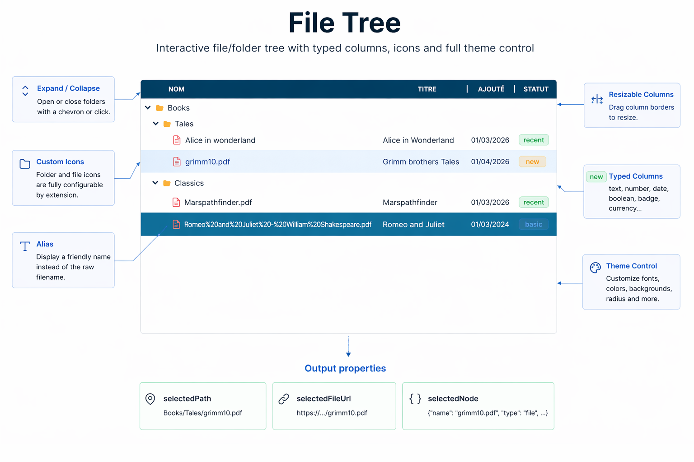

# File Tree

An interactive file/folder tree for Retool with expandable nodes, typed data columns, configurable icons, and full theme control.



## Features

- Expand/collapse folders with chevron or click
- Custom SVG icons per file extension (no external dependency)
- Typed data columns: text, number, date, boolean, badge, currency
- Resizable columns by drag
- Visual editors for columns and icon mappings (toggle with `showEditors`)
- `alias` field to display a friendly name instead of the raw filename
- Output properties: `selectedNode`, `selectedPath`, `selectedFileUrl`
- Full theme control: fonts, background, hover/selected colors, badge border radius

## Installation

1. In your Retool instance, go to **Settings → Custom Components**
2. Create a new library and set the entry point to `src/index.tsx`
3. Copy the contents of `src/` into your library
4. Deploy with `npx retool-ccl deploy`

## treeData format

Set the `treeData` property to a JSON object representing the root node:

```json
{
  "name": "project",
  "type": "folder",
  "children": [
    {
      "name": "src",
      "type": "folder",
      "children": [
        {
          "name": "index.tsx",
          "type": "file",
          "alias": "Entry point",
          "url": "https://example.com/files/index.tsx",
          "status": "active",
          "size": 4096,
          "modified": "2024-03-01"
        }
      ]
    },
    {
      "name": "README.md",
      "type": "file",
      "size": 512,
      "modified": "2024-01-15"
    }
  ]
}
```

| Field | Type | Description |
|-------|------|-------------|
| `name` | string | File/folder name (used as path key) |
| `type` | `"file"` \| `"folder"` | Node type |
| `alias` | string | Optional display name shown instead of `name` |
| `url` | string | Physical link (exposed via `selectedFileUrl`) |
| `children` | array | Child nodes (folders only) |
| any other field | any | Accessible via `selectedNode` and displayable via columns |

## Columns configuration

Set the `columns` property to a JSON array. Example:

```json
[
  { "key": "size", "label": "Size", "type": "number", "format": "filesize", "align": "right", "width": 80 },
  { "key": "modified", "label": "Modified", "type": "date", "align": "center", "width": 100 },
  { "key": "status", "label": "Status", "type": "badge", "colors": { "active": "#22c55e", "draft": "#f59e0b" }, "width": 90 }
]
```

| Column type | Options |
|-------------|---------|
| `text` | — |
| `number` | `format`: `integer`, `decimal:2`, `percent`, `filesize` |
| `date` | `format`: date format string |
| `boolean` | — |
| `badge` | `colors`: map of value → CSS color |
| `currency` | `format`: ISO currency code (e.g. `EUR`, `USD`) |

## Icon configuration

Set the `iconConfig` property to map file extensions to icons:

```json
{
  "pdf": "file-pdf",
  "ts": "file-code",
  "tsx": "file-code",
  "png": "file-image",
  "default": "file"
}
```

Available icons: `folder`, `folder-open`, `file`, `file-pdf`, `file-text`, `file-code`, `file-image`, `file-audio`, `file-video`, `file-archive`, `file-data`, `file-spreadsheet`

## Output properties

| Property | Type | Description |
|----------|------|-------------|
| `selectedPath` | string | Full tree path of selected node (e.g. `project/src/index.tsx`) |
| `selectedFileUrl` | string | `url` field of the selected node |
| `selectedNode` | string (JSON) | All fields of selected node except `children`. Use `JSON.parse(fileTree1.selectedNode)` to access fields. |

## Theme properties

| Property | Default | Description |
|----------|---------|-------------|
| `bgColor` | `#ffffff` | Component background |
| `fontFamily` | Inter | Row font |
| `headerFontFamily` | (same as rows) | Header font |
| `headerBgColor` | `#f9fafb` | Header background |
| `headerTextColor` | auto | Header text color (auto-contrast if empty) |
| `textColor` | auto | Row text color (auto-contrast from `bgColor` if empty) |
| `selectedBgColor` | `#dbeafe` | Selected row background |
| `selectedTextColor` | auto | Selected row text color |
| `hoverBgColor` | `#f3f4f6` | Hovered row background |
| `hoverTextColor` | auto | Hovered row text color |
| `badgeBorderRadius` | `4` | Badge corner radius in px |
| `nameColumnLabel` | `Nom` | Label for the name column header |
