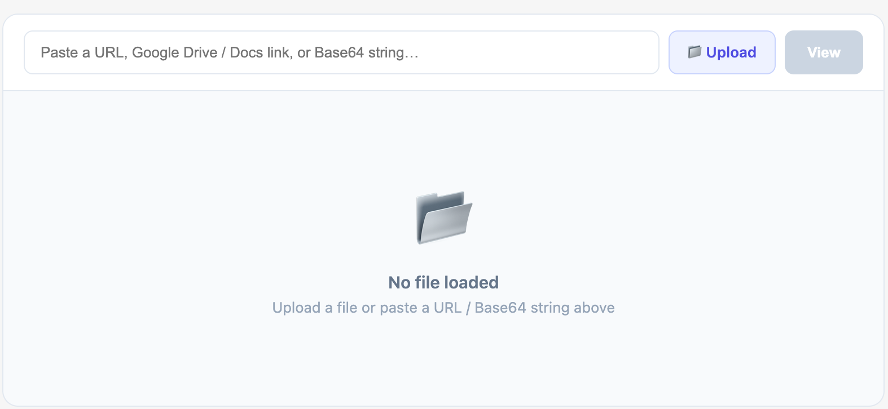

## Username

widlestudiollp

## Project Name

Smart File Viewer

## About

Smart File Viewer is an intelligent, auto-detecting file viewer component for Retool that supports multiple file formats and input sources. It automatically detects the file type and renders it using the appropriate viewer without requiring manual configuration.

The component supports files from uploads, URLs (including Google Drive/Docs), and Base64 strings. It provides a seamless experience for previewing documents, media, and structured data directly inside Retool apps.

## Preview



## How it works

The component receives input via a text field (URL/Base64) or file upload. It then processes the input using a detection engine that determines the file type based on MIME type, file extension, or Base64 signature.

### File detection logic

* Base64 prefix → Determines MIME type (PDF, Image, etc.)
* File extension → Fallback detection (`.docx`, `.xlsx`, `.csv`, etc.)
* Google URLs → Converted into embeddable preview links
* Blob conversion → Ensures consistent rendering across formats

### Rendering logic

* PDF → Rendered using `react-pdf` with pagination
* Word → Converted to HTML using `mammoth`
* Excel → Parsed into table using `xlsx`
* CSV → Custom parser → table view
* JSON → Structured table
* Text → Code-style preview
* Image → Responsive image preview
* Video → Native HTML5 player
* Google Docs/Drive → Embedded iframe preview

### Example input

```json
[
  { "name": "Smith", "role": "Developer" },
  { "name": "John", "role": "Designer" }
]
```

Or Base64:

```
data:application/pdf;base64,JVBERi0xLjQKJ...
```

Or URL:

```
https://drive.google.com/file/d/FILE_ID/view
```

## Build process

The component is built using React and integrates with Retool through `@tryretool/custom-component-support`. It uses multiple libraries for handling different file types and rendering them efficiently.

### Key implementation details

* Uses `useMemo` for optimized file type detection
* Uses `useEffect` for async file loading and parsing
* Converts files to Blob URLs for consistent rendering
* Handles Google Drive/Docs links via URL transformation
* Implements custom parsers for CSV and JSON
* Supports dynamic container resizing using `ResizeObserver`
* Includes proper cleanup for Blob URLs to prevent memory leaks

### Extensibility

The component is designed to be flexible and extensible. Developers can:

* Add support for additional file types (e.g., audio, markdown)
* Replace Word rendering engine for better fidelity
* Add drag-and-drop upload support
* Extend parsing logic for large datasets
* Customize UI themes and controls
* Add caching or file size optimizations
