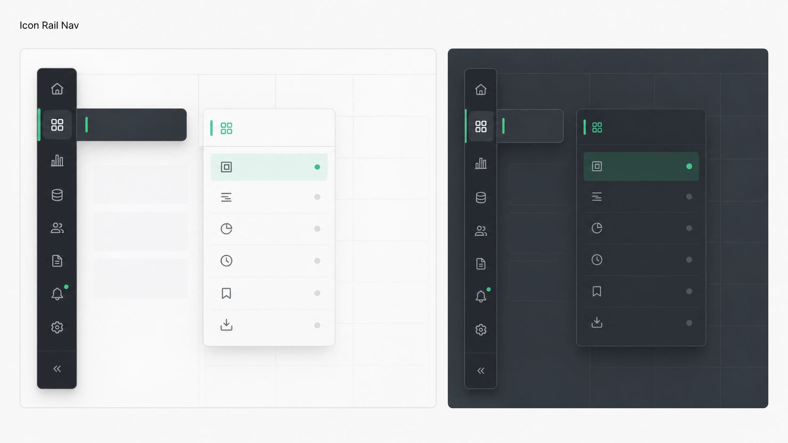

# Icon Rail Nav

A distinctive navigation component for Retool apps, inspired by Supabase's dashboard sidebar. Combines a compact icon rail with a contextual panel that shows sub-items or descriptions for the selected item. Hover the rail to reveal full item labels with a smooth slide animation.



## Why this component?

Most nav components force a tradeoff: compact (just icons, labels hidden) or verbose (takes up a ton of horizontal space). Icon Rail Nav gives you both — a tight **48px icon rail** that's always visible, a **contextual panel** that shows sub-items or descriptions for whatever's selected, and a **hover-reveal** that slides the full labels out from behind the rail when users need them.

The result: screen-efficient nav with zero navigation guesswork.

---

## Features

- **Icon rail + contextual panel** layout in a fixed 220px width
- **Slide-reveal labels** on hover — labels emerge from behind the rail
- **Sub-items** for deep navigation hierarchies
- **Badges, sections, and descriptions** per item
- **Dark and light themes** with custom accent colors
- **Custom icons** — built-in set, image URLs, or data URLs
- **Page and app navigation** via model state and event handlers
- **Developer help panel** with schema reference, icon picker, and copy-paste starter JSON (hideable before shipping)
- **Parse error surfacing** with helpful error messages for invalid JSON

---

## Quickstart

1. Add the Icon Rail Nav component to your Retool app
2. Set the `Menu Items JSON` property in the model panel — use the starter template below
3. Wire the `Navigate` event handler → `Go to page` → `{{ iconRailNav1.model.activePage }}`
4. Done! Click an item to navigate.

### Starter JSON

```json
[
  {
    "id": "home",
    "label": "Home",
    "icon": "table",
    "page": "Dashboard"
  },
  {
    "id": "users",
    "label": "Users",
    "icon": "lock",
    "subItems": [
      { "id": "users-active", "label": "Active",  "page": "ActiveUsers" },
      { "id": "users-pending", "label": "Pending", "page": "PendingUsers" }
    ]
  },
  {
    "id": "reports",
    "label": "Reports",
    "icon": "chart",
    "badge": "New",
    "description": "View analytics and reports"
  }
]
```

---

## Model properties

| Property | Type | Default | Description |
|---|---|---|---|
| `menuEditorVisibility` | `"show"`/`"hide"` | `"hide"` | Shows or hides the visual menu item editor. |
| `helpVisibility` | `"show"`/`"hide"` | `"show"` | Shows or hides the setup help drawer. |
| `itemsJson` | string | `""` | Menu Items JSON: JSON array of nav items (see schema below) |
| `bottomItemsJson` | string | `""` | JSON array of items pinned to the bottom of the rail (e.g. Settings) |
| `activeItem` | string | `"item-1"` | The id of the currently selected item |
| `activeSubItem` | string | `""` | The id of the currently selected sub-item |
| `activePage` | string | `""` | The `page` property of the last-clicked item/sub-item — use in navigate handler |
| `activeApp` | string | `""` | The `app` property of the last-clicked item/sub-item |
| `projectName` | string | `"Main Menu"` | Dynamic/bindable label in the contextual panel header |
| `projectStatus` | string | `"online"` | Status dot color: `"online"` (green), `"offline"` (gray), `"paused"` (amber) |
| `theme` | string | `"dark"` | `"dark"` or `"light"` — controls the contextual panel only (rail is always dark) |
| `railBg` | string | `""` | Custom rail background color (hex) |
| `panelBg` | string | `""` | Custom contextual panel background color (hex) |
| `accentColor` | string | `"#3ecf8e"` | Highlight color for active items, badges, and accents |
| `padding` | number | `0` | Outer padding in pixels. Use a negative value to compensate for Retool wrapper inset. |
| `menuItems` | array | `[]` | Hidden visual editor output or directly bound array of nav item objects. Takes priority over `itemsJson` when non-empty. |
| `pageOptions` | array | `[]` | Optional page dropdown choices for the visual editor. Use strings or `{ label, value }` objects. |
| `appOptions` | array | `[]` | Optional app dropdown choices for the visual editor. Use strings or `{ label, value }` objects. |
| `menuJsonDraft` | string | `""` | Hidden JSON output for optional `saveMenu` handlers. |

---

## Item schema

```ts
{
  id:          string;  // required, unique
  label:       string;  // required, display text
  icon:        string;  // built-in key, image URL, or data URL
  page?:       string;  // Retool page name to navigate to
  app?:        string;  // Retool app name to open
  badge?:      string;  // small pill text, e.g. "New" or "Beta"
  color?:      string;  // hex color for this item's icon/text
  section?:    string;  // divider label above this item
  description?:string;  // shown in the right panel when no sub-items
  subItems?:   SubItem[]; // nested navigation
}
```

### SubItem schema

```ts
{
  id:    string;  // required, unique
  label: string;  // required, display text
  page?: string;  // Retool page name to navigate to
  app?:  string;  // Retool app name to open
}
```

### Built-in icon keys

`table` • `code` • `database` • `lock` • `storage` • `function` • `realtime` • `clock` • `info` • `logs` • `chart` • `settings`

For custom icons, use a hosted image URL or a data URL:
- **URL:** `"https://example.com/icon.png"` (must be CORS-enabled)
- **Data URL:** `"data:image/png;base64,iVBORw0KGgo..."` (always works)

---

## Events

| Event | When it fires |
|---|---|
| `itemClick` | A top-level rail item was clicked |
| `subItemClick` | A sub-item was clicked in the contextual panel |
| `navigate` | An item or sub-item with a `page`/`app` was clicked — wire this to `Go to page` action |
| `saveMenu` | The visual editor's Save event button was clicked |

---

## Wiring navigation

Because Retool custom components run in an iframe and can't directly control page navigation, the component exposes state that developer handlers can react to:

1. On the component's **Event handlers**, add a handler for the **Navigate** event
2. Set **Action** to **"Go to page"**
3. Set **Page** to `{{ iconRailNav1.model.activePage }}`

For app navigation:
- Set **Action** to **"Go to app"**
- Set **App** to `{{ iconRailNav1.model.activeApp }}`

---

## Example use cases

- **Internal dashboards** — nav between Sales, Users, Reports, Settings
- **Admin panels** — deeply hierarchical nav with sub-sections
- **Multi-tenant apps** — each tenant sees a different nav set
- **Documentation/help centers** — icon rail for sections, sub-items for articles

---

## Credits

Inspired by the Supabase dashboard sidebar. Built for the Retool custom component contest.

## Contest submission checklist

- Exported component lives at `src/components/IconRailNav`
- `src/index.tsx` exports only `IconRailNav`
- Run `npm run typecheck` and `npm test` before submitting
- Add a final `cover.png` screenshot/GIF under 2MB for the gallery PR

## License

MIT
