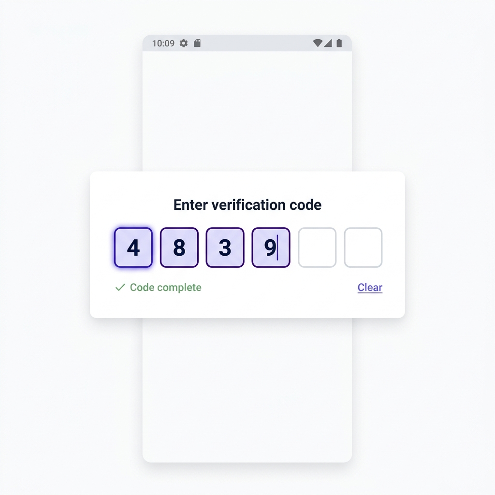

# OTP Input

> A customizable one-time password (OTP) input component with auto-advance, paste support, and real-time output for Retool.

## Author

- **Name:** Taha Amin
- **Community Username:** @tahaamin
- **Email:** taha.internise@gmail.com

## About

OTP Input is a custom Retool component that renders individual digit boxes for entering one-time passwords or verification codes — a UI pattern common in 2FA, SMS verification, and PIN entry flows. It automatically advances focus to the next box as the user types, supports full paste-in of codes, and outputs the complete code as a string to the Retool app in real time. It is configurable for any number of digits, accent color, and label text.

## Tags

`Forms`, `Input`, `Authentication`, `OTP`, `Verification`, `2FA`

## How It Works

The component renders N individual `<input>` boxes (default: 6) in a flexbox row. Each input accepts a single numeric digit. When a digit is entered, focus automatically moves to the next box. Backspace moves focus backwards and clears the previous digit. Full OTP codes can be pasted in and are distributed across the boxes automatically.

On every keystroke and paste, `window.Retool.modelUpdate()` is called with:
- `otp` — the current string of entered digits (e.g. `"483921"`)
- `isComplete` — `true` when all boxes are filled
- `length` — number of digits entered so far

The Retool app can listen to `otpInput.model.otp` and `otpInput.model.isComplete` to trigger queries when the code is fully entered.

**Configurable via Retool model input:**
- `digits` — number of input boxes (default: 6)
- `label` — label text shown above the inputs
- `accentColor` — hex color for focus/filled state (default: `#6366f1`)
- `clearOtp` — set to `true` to programmatically clear all inputs

## Build Process

1. Dynamically built N input elements based on the `digits` model property
2. `keydown` handler manages backspace navigation and arrow key movement between boxes
3. `paste` handler strips non-numeric characters and distributes pasted digits across boxes
4. `input` handler enforces single-digit numeric entry and triggers auto-advance
5. Accent color is applied dynamically via inline styles so it responds to Retool model changes
6. All state is pushed back to Retool via `window.Retool.modelUpdate()` on every change
7. `window.Retool.subscribe()` listens for model changes to allow programmatic control (clear, reconfigure)
8. Zero external dependencies — plain HTML, CSS, and vanilla JavaScript only

## Demo Video

N/A

## Preview

