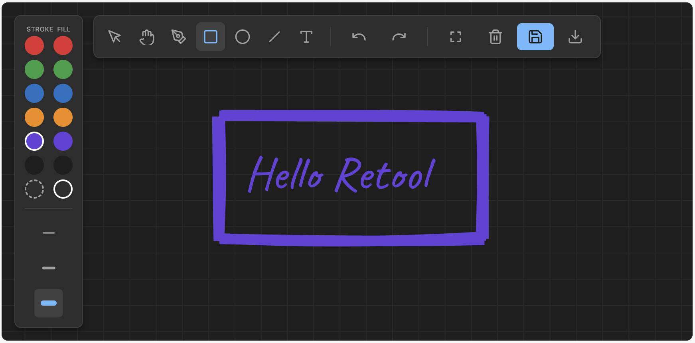

# Plot Twist

Plot Twist is a collaborative, open-ended whiteboard custom component for Retool. It allows users to sketch diagrams, wireframes, and ideas with a beautiful hand-drawn aesthetic directly inside your internal Retool apps.



## Features

- **Infinite Canvas:** Navigate seamlessly using Trackpad Pinch-to-Zoom and Spacebar+Drag panning.
- **Refocus View:** Instantly center and zoom the camera to fit all shapes perfectly on the screen.
- **Hand-Drawn Aesthetic:** Powered by `rough.js` for that organic, sketchy look.
- **Rich Toolset:** Select, Pan, Pen, Rectangle, Ellipse, Line, and Text tools.
- **Undo / Redo Stack:** Make mistakes freely. (Shortcuts: `Cmd+Z` / `Cmd+Shift+Z`)
- **Keyboard Shortcuts:** Rapidly switch tools with single keystrokes (`V`, `Space`, `P`, `R`, `E`, `L`, `T`).
- **Database Integration:** Built to connect bidirectionally with PostgreSQL databases out-of-the-box.
- **Direct PNG Export:** Instantly download your masterpieces directly from the component without needing external JavaScript queries.

## Installation

Because this is a Retool Custom Component, you deploy it using the `retool-ccl` CLI:

```bash
# Clone or download this project
git clone ...

# Install dependencies
npm install

# Authenticate with your Retool instance
npx retool-ccl login

# Build and deploy
npx retool-ccl deploy
```

## Component API & Usage

Once deployed, drag the "Plot Twist" component into your Retool app. It exposes the following properties and events to allow full two-way synchronization.

### Model Properties

| Property | Type | Description |
|----------|------|-------------|
| `sceneData` | JSON | The real-time serialized JSON object of the entire whiteboard scene. |
| `backgroundColor` | String | Sets the background hex color. Default: `#1E1E1E` (Dark theme) |
| `exportDataUrl` | String | Contains the base64 PNG data URL when the user clicks Export. |
| `selectedElement` | Object | The currently selected shape object on the canvas. |

### Events

| Event Name | Trigger | Use Case |
|------------|---------|----------|
| `save` | User clicks the floppy disk icon or `Ctrl+S`. | Trigger a SQL UPDATE query to save `sceneData`. |
| `exportImage` | User clicks the download icon. | **[Deprecated]** Handled natively by the component now. |
| `elementSelected`| User clicks an element on canvas. | Show contextual properties in your Retool app sidebar. |

## Quick Start Database Integration

Plot Twist is designed to be fully persistent. Here is a quick guide to wiring it up.

### 1. The Database Table (PostgreSQL)
Create a table to store your whiteboard sessions:
```sql
CREATE TABLE whiteboard_sessions (
  id UUID PRIMARY KEY DEFAULT gen_random_uuid(),
  name TEXT NOT NULL,
  scene_data JSONB NOT NULL DEFAULT '{}',
  updated_at TIMESTAMPTZ DEFAULT NOW()
);
```

### 2. Loading Data
Create a query `loadSession` and bind it to a table component:
```sql
SELECT scene_data FROM whiteboard_sessions WHERE id = {{ sessionsTable.selectedRow.id }}
```
**In the Inspector:** Set Plot Twist's `sceneData` model to `{{ loadSession.data.scene_data[0] }}`. 
*Plot Twist will automatically parse the JSON and render the canvas!*

### 3. Saving Data
Create a query `saveSession`:
```sql
UPDATE whiteboard_sessions 
SET scene_data = {{ JSON.stringify(plotTwist1.sceneData) }}, updated_at = NOW() 
WHERE id = {{ sessionsTable.selectedRow.id }}
```
**In the Inspector:** Go to Event Handlers, listen for `save`, and trigger the `saveSession` query.

## Architecture & Performance

This component is built from scratch using HTML5 Canvas to ensure maximum performance within Retool's iframe constraints. 

By keeping our architecture highly modular and utilizing pure functions, the entire production bundle (including `rough.js` and React) compiles down to an astonishingly small size:

- **JavaScript Bundle:** `51.9 KB`
- **CSS Styles:** `2.7 KB`

Because the bundle is so lightweight, the whiteboard loads instantaneously without blocking the Retool UI thread.

- `PlotTwist.tsx`: The main orchestration component and Retool data bridge.
- `canvas/renderer.ts`: The rendering engine utilizing Canvas 2D API and `roughjs`.
- `state/history.ts`: Pure functional time-travel state manager (Undo/Redo stack).
- `state/scene.ts`: Pure functions for mutating shapes safely without mutating React state.
- `state/viewport.ts`: Mathematical coordinate transformations for the infinite camera (Screen-to-World).

## Testing

Pure functions (history and scene logic) are tested via Vitest:

```bash
npm test
```
