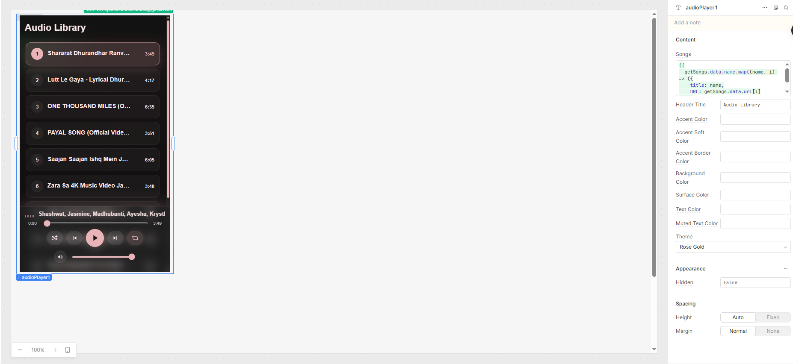

## Username

widlestudiollp

## Project Name

Smart Audio Player Pro

## About

Smart Audio Player Pro is a powerful and modern Retool custom component designed to provide a rich music playback experience directly inside your Retool apps.

It includes features like shuffle, repeat modes, playback memory, smooth transitions, responsive layouts, and dynamic theming — all without relying on third-party APIs.

The component is built to mimic real-world music players like Spotify while remaining fully customizable inside Retool.

---

## Preview



---

## Features

- 🎵 Play / Pause / Next / Previous controls
- 🔀 Smart Shuffle (no repeat until cycle completes)
- 🔁 Repeat modes (All / One / Off)
- 💾 Playback memory (resume song + timestamp)
- 🎧 Mini player on scroll
- 📱 Fullscreen player mode
- 🎚 Smooth volume control + mute toggle
- ⚡ Fade-in audio transitions
- 🏷 Dynamic song duration display
- 🔄 Auto-play next song
- 🎨 Multiple themes + custom color support
- 📊 Responsive grid layout for song list

---

## How it works

The component receives songs from Retool using the `songs` input.

Each song should include:

- `title` → Song name  
- `URL` → Direct audio file link  

The player manages playback state internally and automatically handles:

- Progress tracking  
- Song switching  
- Shuffle queue logic  
- Memory persistence (via localStorage)  

---

## Example input

```json
[
  {
    "title": "Sound Helix Song 1",
    "URL": "https://www.soundhelix.com/examples/mp3/SoundHelix-Song-1.mp3"
  },
  {
    "title": "Sound Helix Song 2",
    "URL": "https://www.soundhelix.com/examples/mp3/SoundHelix-Song-2.mp3"
  }
]