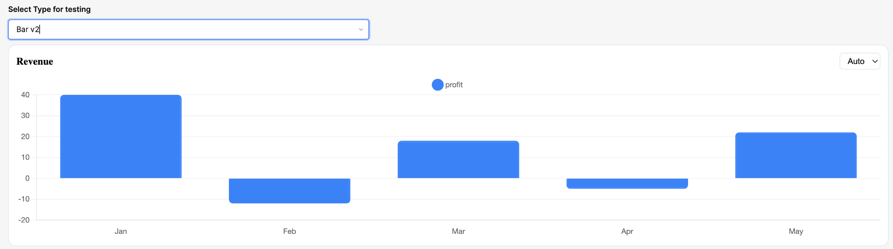

## Username

widlestudiollp

## Project Name

Smart Chart

## About

Smart Chart is an intelligent, auto-configuring chart component for Retool that analyzes input data and automatically renders the most appropriate visualization without requiring manual configuration. It supports multiple chart types including bar, line, grouped bar, multi-line, pie, and donut charts, with seamless switching between them. This helps developers quickly build rich, flexible data visualizations while minimizing setup effort.

## Preview



## How it works

The component receives data via Retool state (`chartData`) and evaluates its structure using a custom data analysis engine. Based on the shape and type of the data, it automatically determines the most suitable chart type.

### Chart selection logic

* Object data → Pie / Donut chart
* Name-value pairs → Pie / Donut
* Time-based single metric → Line chart
* Time-based multiple metrics → Multi-line / Grouped bar
* Single numeric field → Bar chart
* Multiple numeric fields → Grouped bar / Multi-line

The component normalizes incoming data and dynamically constructs Chart.js datasets. It ensures consistent rendering regardless of input format.

Users can override the automatically selected chart type using a dropdown. Only valid chart types for the detected data structure are shown, preventing incorrect configurations.

### Example input

```json
[
  { "month": "Jan", "profit": 40 },
  { "month": "Feb", "profit": -10 },
  { "month": "Mar", "profit": 18 },
  { "month": "Apr", "profit": -5 },
  { "month": "May", "profit": 22 }
]
```

## Build process

The component is built using React and integrates with Retool through `@tryretool/custom-component-support`. Chart rendering is powered by Chart.js via `react-chartjs-2`.

### Key implementation details

* Uses `useMemo` for efficient data processing and optimized re-rendering
* Implements a custom data analysis engine to infer chart types dynamically
* Automatically generates datasets and labels based on input structure
* Applies a consistent color palette for better visual clarity
* Fully responsive layout with optimized performance (animations disabled)

### Extensibility

The component is designed to be easily extendable. Developers can:

* Add additional chart types (e.g., radar, area)
* Customize chart options and themes
* Enhance data detection logic for more complex datasets
* Integrate additional configuration controls

