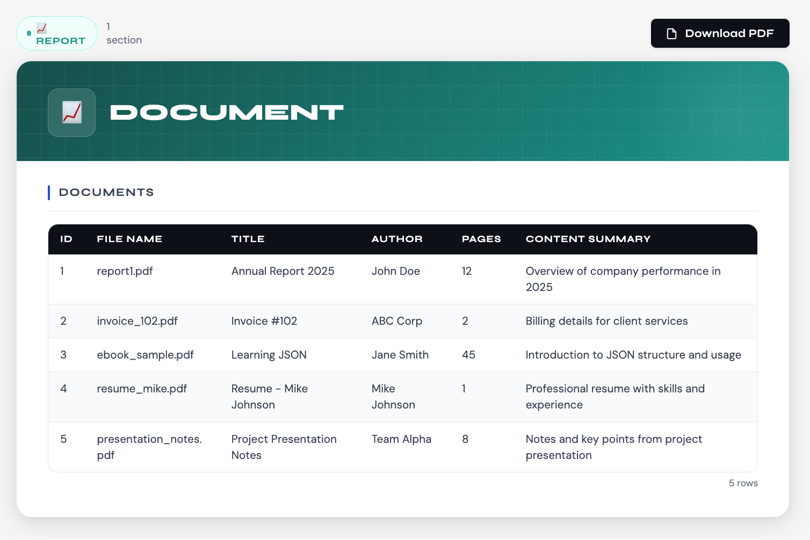

## Username

widlestudiollp

## Project Name

Smart Auto PDF Engine

## About

Smart Auto PDF Engine is an intelligent, auto-detecting document generator for Retool that analyzes any input data and transforms it into a structured, printable document with live preview and PDF export functionality. It supports multiple document types such as invoices, reports, payslips, and generic data layouts without requiring predefined schemas.

The component automatically interprets raw JSON, detects structure, and renders a clean UI along with a high-quality downloadable PDF. This allows developers to quickly generate professional documents from any backend response with minimal configuration.

## Preview



## How it works

The component receives data via Retool state (`schema`) and processes it using a smart normalization engine. It evaluates the structure of the data and converts it into a unified internal model that can be rendered both in UI and PDF format.

### Data interpretation logic

* Structured data (`sections`) → Render directly (grid, table, text, summary)
* Flat objects → Converted into key-value sections
* Nested objects → Recursively expanded into multiple sections
* Arrays of objects → Converted into tables
* Arrays of primitives → Rendered as text
* Mixed / irregular data → Safely normalized and displayed without breaking

### Document detection logic

* Invoice-like data → Invoice layout
* Payslip-like data → Salary/payslip layout
* Analytical data → Report layout
* Unknown structure → Generic document layout

### Example input

```json
{
  "employee": {
    "name": "John Doe",
    "department": "Engineering"
  },
  "earnings": {
    "basic": 50000,
    "hra": 20000
  },
  "deductions": {
    "tax": 8000
  },
  "netPay": 62000
}